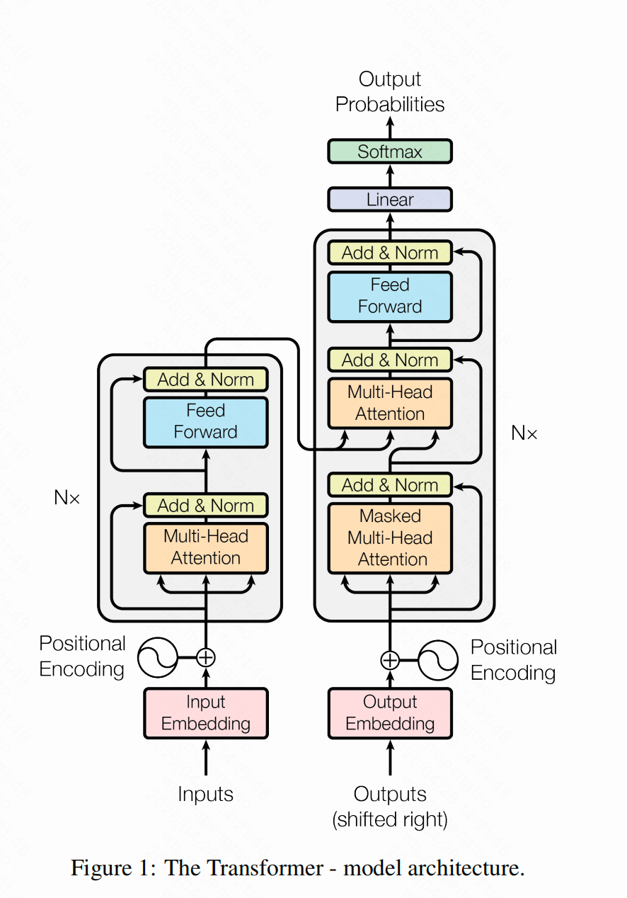
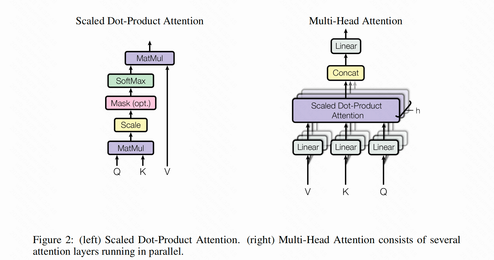

# Attention Is All You Need

> 注：以下论文翻译仅供个人参考

## 摘要

当前主流的序列转换模型均基于包含编码器与解码器的复杂循环神经网络或卷积神经网络。其中性能最优的模型还会通过注意力机制连接编码器与解码器。本文提出了一种全新的、仅基于注意力机制的简洁网络架构 ——Transformer，该架构完全摒弃了循环结构与卷积操作。在两项机器翻译任务上的实验表明，Transformer 模型不仅翻译质量更优，还具备更强的并行化能力，训练耗时显著降低。在 WMT 2014 英德翻译任务中，我们的模型取得了 28.4 的 BLEU 值，相比现有最佳结果（含集成模型）提升了超过 2 个 BLEU 点；在 WMT 2014 英法翻译任务中，模型在 8 块 GPU 上训练 3.5 天后，以远低于文献中最优模型的训练成本，取得了 41.0 的 BLEU 值，创下了单模型的新 SOTA 记录。

> BLEU（Bilingual Evaluation Understudy，双语评估辅助工具）是机器翻译领域最经典、最常用的**自动评价指标**，用来衡量机器翻译结果与人工参考译文的匹配度。

## 1 引言

循环神经网络（尤其是长短期记忆网络 [12] 与门控循环单元网络 [7]），已成为序列建模与序列转换问题（如语言建模、机器翻译 [29, 2, 5]）中的主流最优方案。此后，大量研究持续推动循环语言模型与编码器 - 解码器架构的性能边界 [31, 21, 13]。

循环模型通常沿输入、输出序列的符号位置拆分计算流程。将位置与计算时间步对齐后，模型会基于前一时刻的隐藏状态 \(h_{t-1}\) 和位置 \(t\) 的输入，生成当前时刻的隐藏状态序列 \(h_t\)。这种固有的串行特性，使得训练样本内部无法实现并行计算；当序列长度较长时，内存限制会进一步制约跨样本的批处理能力，该问题会变得尤为突出。近期的研究通过因式分解技巧 [18] 与条件计算 [26] 显著提升了计算效率，其中条件计算还同步提升了模型性能。但**串行计算带来的根本性限制，依然没有被解决**。

注意力机制已成为各类任务中主流序列建模与转换模型的核心组成部分，它能够建模序列中不依赖距离的依赖关系 [2, 16]。然而，除少数例外情况 [22]，这类注意力机制仍需与循环网络结合使用。

在本研究中，我们提出了**Transformer**——一种摒弃循环结构、完全依赖注意力机制来建模输入与输出间全局依赖关系的模型架构。Transformer 支持更高程度的并行化，仅需在8块P100 GPU上训练12小时，就能在翻译质量上达到新的SOTA水平。

## 2 background

减少串行计算量的目标，也是 Extended Neural GPU [20]、ByteNet [15] 和 ConvS2S [8] 的设计基础 —— 这三类模型均以卷积神经网络为核心模块，可并行计算所有输入、输出位置的隐藏表示。但在这些模型中，关联任意两个输入 / 输出位置信号所需的运算量，会随位置间的距离增长：ConvS2S 为线性增长，ByteNet 为对数增长，这导致模型难以学习远距离位置间的依赖关系 [11]。而在 Transformer 中，该运算量被降低为常数级别；不过这会因注意力加权位置的平均操作导致有效分辨率下降，我们将在 3.2 节中介绍的多头注意力机制可以抵消这一影响。

自注意力（也称为内部注意力）是一种注意力机制，它通过关联单个序列中不同位置的信息，来计算该序列的表示。自注意力已在阅读理解、生成式摘要、文本蕴含、任务无关句向量学习等多种任务中取得了成功应用 [4, 22, 23, 19]。

端到端记忆网络基于循环注意力机制（而非序列对齐的循环结构）构建，已被证明在简单语言问答与语言建模任务中表现出色 [28]。

据我们所知，Transformer 是首个完全依赖自注意力机制计算输入、输出表示，且不使用序列对齐的 RNN 或卷积操作的序列转换模型。在后续章节中，我们将详细介绍 Transformer 的架构，阐述自注意力的设计动机，并讨论其相比 [14, 15] 和 [8] 等模型的优势。

## 3 Model Architecture

当前主流的序列转换神经网络模型，大多采用编码器 - 解码器结构 [5, 2, 29]。在这类结构中，编码器会将符号表示形式的输入序列 (x1,...,xn) 映射为连续表示序列 z=(z1,...,zn)；解码器则基于 z，逐个生成符号形式的输出序列 (y1,...,ym)。在每一步生成过程中，模型都是自回归的 [9]—— 即生成下一个符号时，会将此前生成的所有符号作为额外输入。

Transformer 沿用了这一整体架构，编码器与解码器均采用堆叠的自注意力层和逐点全连接层构建，分别对应图 1 的左半部分与右半部分。

### 3.1 Encoder and Decoder Stacks

**编码器**：编码器由 \(N=6\) 个完全相同的层堆叠而成。每个层包含两个子层：第一个是多头自注意力机制，第二个是简单的、逐位置的全连接前馈网络。我们为这两个子层均添加了残差连接 [10]，随后进行层归一化 [1]。也就是说，每个子层的输出为 \(\text{LayerNorm}(x + \text{Sublayer}(x))\)，其中 \(\text{Sublayer}(x)\) 是该子层自身实现的函数。为了适配这些残差连接，模型中的所有子层以及嵌入层的输出维度均设置为 \(d_{\text{model}} = 512\)。

**解码器**：解码器同样由 \(N=6\) 个完全相同的层堆叠而成。除了编码器层包含的两个子层外，解码器额外加入了第三个子层，该子层会对编码器堆叠的输出执行多头注意力计算。与编码器类似，解码器的每个子层也都添加了残差连接，并进行层归一化。我们还修改了解码器堆叠中的自注意力子层，以禁止位置关注后续位置的信息。这种掩码机制，再加上输出嵌入会偏移一个位置的设计，确保了位置 \(i\) 的预测只能依赖位置小于 \(i\) 的已知输出。

### 3.2 Attention

注意力函数可以被描述为将一个查询（query）和一组键值对（key-value pairs）映射为一个输出的过程，其中查询、键、值和输出均为向量。输出是值的加权和，而每个值对应的权重，由查询与对应键之间的兼容性函数计算得出。

#### 3.2.1 Scaled Dot-Product Attention

我们将本文采用的注意力机制命名为**缩放点积注意力**（见图2）。其输入包含维度为 \(d_k\) 的查询（queries）与键（keys），以及维度为 \(d_v\) 的值（values）。计算流程为：先计算查询与所有键的点积，再将每个结果除以 \(\sqrt{d_k}\)，最后通过softmax函数得到各值对应的权重。

图2：（左）缩放点积注意力示意图；（右）多头注意力由多个并行运行的注意力层组成。

实际实现中，我们会将一组查询打包为矩阵 \(Q\)，键与值也分别打包为矩阵 \(K\) 和 \(V\)，批量计算注意力函数。输出矩阵的计算公式如下：
\[
\text{Attention}(Q, K, V) = \text{softmax}\left(\frac{QK^T}{\sqrt{d_k}}\right)V \tag{1}
\]

目前最常用的两种注意力函数是**加性注意力** [2] 和**点积（乘性）注意力**。点积注意力与本文算法的区别仅在于缺少 \(\frac{1}{\sqrt{d_k}}\) 这一缩放因子。加性注意力则使用含单个隐藏层的前馈网络来计算兼容性函数。尽管二者理论复杂度相近，但点积注意力在实际应用中速度更快、空间效率更高，因为它可以通过高度优化的矩阵乘法实现。

当 \(d_k\) 较小时，两种机制的性能相近；但当 \(d_k\) 较大时，未缩放的点积注意力性能会弱于加性注意力 [3]。我们推测，当 \(d_k\) 较大时，点积的结果数值会显著增大，导致softmax函数进入梯度极小的饱和区\(^4\)。为了抵消这一影响，我们将点积结果除以 \(\sqrt{d_k}\) 进行缩放。

> \(^4\) 为说明点积结果为何会变大，假设 \(q\) 和 \(k\) 的分量是均值为0、方差为1的独立随机变量，则它们的点积 \(q \cdot k = \sum_{i=1}^{d_k} q_i k_i\) 的均值为0，方差为 \(d_k\)。

#### 3.2.2 Multi-Head Attention

不同于直接对维度为 \(d_{\text{model}}\) 的键、值和查询执行单次注意力计算，我们发现：将查询、键和值通过**h组不同的可学习线性投影**，分别映射到 \(d_k\)、\(d_k\) 和 \(d_v\) 维度后，再并行执行注意力计算会带来显著收益。每组投影后的查询、键、值会并行计算注意力，得到维度为 \(d_v\) 的输出值；这些输出值会被拼接后，再通过一次线性投影得到最终结果，如图2所示。

多头注意力让模型能够同时关注来自不同位置、不同表示子空间的信息。而单头注意力的平均操作会抑制这种多维度的信息捕捉能力。

多头注意力的计算公式为：
\[
\text{MultiHead}(Q, K, V) = \text{Concat}(\text{head}_1, ..., \text{head}_h) W^O
\]
其中，每个头的计算为：
\[
\text{head}_i = \text{Attention}(QW_i^Q, KW_i^K, VW_i^V)
\]
式中，投影矩阵为可学习参数：
- \(W_i^Q \in \mathbb{R}^{d_{\text{model}} \times d_k}\)
- \(W_i^K \in \mathbb{R}^{d_{\text{model}} \times d_k}\)
- \(W_i^V \in \mathbb{R}^{d_{\text{model}} \times d_v}\)
- \(W^O \in \mathbb{R}^{h d_v \times d_{\text{model}}}\)

本研究中，我们使用 \(h=8\) 个并行注意力层（即“头”）。每个头的维度为 \(d_k = d_v = d_{\text{model}} / h = 64\)。由于每个头的维度被降低，多头注意力的总计算成本与全维度单头注意力相当。

#### 3.2.3 Applications of Attention in our Model

Transformer以三种不同的方式使用多头注意力：

1.  **编码器-解码器注意力（Encoder-Decoder Attention）**
    查询（Queries）来自解码器的上一层输出，而键（Keys）和值（Values）则来自编码器的最终输出。这使得解码器的每个位置都能关注输入序列的所有位置信息，模仿了序列到序列模型中经典的编码器-解码器注意力机制 [31, 2, 8]。

2.  **编码器自注意力（Encoder Self-Attention）**
    编码器中包含自注意力层。在自注意力层中，键、值和查询均来自同一来源——编码器上一层的输出。编码器的每个位置都可以关注上一层的所有位置信息，从而捕捉输入序列内部的上下文关联。

3.  **解码器掩码自注意力（Decoder Masked Self-Attention）**
    解码器中的自注意力层，允许每个位置关注当前位置及之前的所有位置。为了保持自回归生成的特性（即生成时不能看到未来信息），我们需要阻止信息在解码器中向左流动。这一约束通过在缩放点积注意力的softmax输入中，将所有非法连接（未来位置）的值屏蔽（设为-∞）来实现，详见图2。

### 3.3 Position-wise Feed-Forward Networks

除注意力子层外，编码器和解码器的每一层都包含一个全连接前馈网络，该网络对序列中的每个位置**独立且相同地**执行变换。其结构为：两个线性变换层，中间夹着ReLU激活函数。

\[
\mathrm{FFN}(x) = \max(0, xW_1 + b_1)W_2 + b_2 \tag{2}
\]

尽管不同位置使用的线性变换参数相同，但不同层的参数相互独立。该过程也可等价描述为两次**卷积核大小为1的一维卷积**。输入与输出维度为 \(d_{\text{model}}=512\)，中间隐藏层维度为 \(d_{ff}=2048\)。

### 3.4 Embeddings and Softmax
与其他序列转换模型类似，我们使用可学习的嵌入层，将输入与输出token映射为维度为 \(d_{\text{model}}\) 的向量。同时，我们通过可学习的线性变换层与Softmax函数，将解码器的输出转换为下一个token的预测概率分布。本模型中，两个嵌入层（输入、输出）与Softmax前的线性变换层**共享同一权重矩阵**，这一设计参考了文献[24]。此外，嵌入层的权重会乘以 \(\sqrt{d_{\text{model}}}\) 进行缩放。

### 3.5 Positional Encoding

由于本模型不含循环结构也不含卷积操作，为了让模型能够利用序列的顺序信息，我们必须向模型注入关于序列中token相对位置或绝对位置的信息。为此，我们在编码器与解码器堆叠结构的底部，为输入嵌入添加“位置编码”。位置编码与嵌入向量的维度相同（均为 \(d_{\text{model}}\)），因此二者可以直接相加。位置编码的实现方式有很多种，包括可学习的和固定的 [8]。

本研究中，我们使用不同频率的正弦和余弦函数来实现位置编码：
\[
\begin{align*}
PE_{(pos,2i)} &= \sin\left(pos / 10000^{2i/d_{\text{model}}}\right) \\
PE_{(pos,2i+1)} &= \cos\left(pos / 10000^{2i/d_{\text{model}}}\right)
\end{align*}
\]
其中 \(pos\) 表示位置，\(i\) 表示维度。也就是说，位置编码的每个维度都对应一个正弦曲线，其波长按几何级数从 \(2\pi\) 扩展到 \(10000 \cdot 2\pi\)。我们选择该函数的原因是：它能让模型轻松学习相对位置依赖——对于任意固定偏移量 \(k\)，\(PE_{pos+k}\) 都可以表示为 \(PE_{pos}\) 的线性函数。

我们也尝试了使用可学习的位置嵌入 [8]，发现两种方案的效果几乎完全一致（见表3第(E)行）。最终选择正弦余弦版本，是因为它能让模型外推到比训练时更长的序列长度。

**表1：不同层类型的每层复杂度、最小串行操作数与最大路径长度**
注：\(n\) 为序列长度，\(d\) 为表示维度，\(k\) 为卷积核大小，\(r\) 为受限自注意力的邻域大小。

| 层类型                | 每层复杂度           | 串行操作数 | 最大路径长度     |
|:----------------------|----------------------|------------|------------------|
| 自注意力 Self-Attention | \(O(n^2 \cdot d)\)   | \(O(1)\)   | \(O(1)\)         |
| 循环网络 Recurrent    | \(O(n \cdot d^2)\)   | \(O(n)\)   | \(O(n)\)         |
| 卷积网络 Convolutional | \(O(k \cdot n \cdot d^2)\) | \(O(1)\) | \(O(\log_k(n))\) |
| 受限自注意力 Self-Attention (restricted) | \(O(r \cdot n \cdot d)\)   | \(O(1)\)   | \(O(n/r)\)       |

## 4 Why Self-Attention

在本节中，我们从多个维度对比自注意力层与循环层、卷积层。这些层常用于将一个变长的符号表示序列 \((x_1, ..., x_n)\) 映射为等长的输出序列 \((z_1, ..., z_n)\)（其中 \(x_i, z_i \in \mathbb{R}^d\)），典型场景如序列转换模型的编码器/解码器隐藏层。为了说明选择自注意力的动机，我们主要考量三个核心指标：

1.  **每层的总计算复杂度**
2.  **可并行化的计算量**（以所需的最小串行操作数衡量）
3.  **网络中长距离依赖的路径长度**

长距离依赖建模是许多序列转换任务的核心挑战，而影响模型学习这类依赖能力的关键因素，是信号在网络中前向与反向传播的路径长度。输入、输出序列任意位置间的路径越短，模型就越容易学习到长距离依赖关系 [11]。因此，我们也对比了不同层类型构成的网络中，任意两个输入/输出位置间的最大路径长度。

如表1所示，自注意力层仅需常数级的串行操作即可连接所有位置，而循环层需要 \(O(n)\) 级别的串行操作。在计算复杂度方面，当序列长度 \(n\) 小于表示维度 \(d\) 时（机器翻译的SOTA模型中，词片段 [31]、字节对 [25] 等句子表示通常满足这一条件），自注意力层比循环层更快。针对超长序列任务，可通过限制自注意力仅关注输出位置附近大小为 \(r\) 的局部邻域来提升效率，这会将最大路径长度提升至 \(O(n/r)\)，我们计划在未来工作中深入探究这一方案。

对于卷积层，当卷积核宽度 \(k < n\) 时，单层卷积无法连接所有输入/输出位置：使用连续卷积核需要堆叠 \(O(n/k)\) 层，使用空洞卷积 [15] 则需要 \(O(\log_k(n))\) 层，这会增加网络中任意位置间的最长路径长度。卷积层的计算成本通常是循环层的 \(k\) 倍；而可分离卷积 [6] 可大幅降低复杂度至 \(O(k \cdot n \cdot d + n \cdot d^2)\)。即使 \(k=n\)，可分离卷积的复杂度也与自注意力层+逐位置前馈层的组合（即本模型采用的方案）相当。

此外，自注意力还能带来模型可解释性的提升。我们在附录中分析了模型的注意力分布并给出示例：不仅不同的注意力头会学习到不同的任务模式，许多头还展现出与句子句法、语义结构相关的行为特征。

## 5 Training

本章介绍模型的训练方案。

### 5.1 Training Data and Batching

模型在标准WMT 2014英德数据集上训练，该数据集包含约450万句对。句子采用字节对编码（BPE）[3]处理，源语言与目标语言共享约37000个token的词表。对于英法翻译任务，我们使用规模更大的WMT 2014英法数据集（含3600万句对），并采用词片段（word-piece）[31]将token切分为32000个词表单元。句对按近似序列长度进行批处理，每个训练批次包含约25000个源语言token和25000个目标语言token。

### 5.2 Hardware and Schedule

模型在一台配备8块NVIDIA P100 GPU的机器上训练。使用论文中描述的超参数的基础模型，每步训练耗时约0.4秒，共训练10万步（约12小时）；表3中描述的大模型每步耗时1.0秒，共训练30万步（约3.5天）。

### 5.3 Optimizer

我们使用Adam优化器 [17]，参数设置为 \(β_1=0.9\)、\(β_2=0.98\)、\(ε=10^{-9}\)。训练过程中，学习率按以下公式动态调整：

\[
lrate = d_{\text{model}}^{-0.5} \cdot \min(step\_num^{-0.5}, step\_num \cdot warmup\_steps^{-1.5}) \tag{3}
\]

该公式对应：在前 `warmup_steps` 步内，学习率线性增长；之后按步数的平方根倒数比例衰减。本研究中设置 `warmup_steps=4000`。

### 5.4 Regularization

训练过程中，我们采用了三种正则化方法：

**残差Dropout**
我们在每个子层的输出上应用Dropout [27]，该操作在子层输出与输入相加并进行层归一化之前执行。此外，编码器和解码器堆叠结构中，嵌入向量与位置编码相加后的结果也会应用Dropout。基础模型的Dropout率设置为 \(P_{drop}=0.1\)。

**表2：Transformer在WMT 2014英德、英法翻译任务的newstest2014测试集上，以远低于先前最优模型的训练成本，取得了更高的BLEU分数**

| 模型                       | BLEU（英德） | BLEU（英法） | 训练成本（FLOPs）英德 | 训练成本（FLOPs）英法 |
| -------------------------- | ------------ | ------------ | --------------------- | --------------------- |
| ByteNet [15]               | 23.75        | -            | -                     | -                     |
| Deep-Att + PosUnk [32]     | -            | 39.2         | -                     | \(1.0 \cdot 10^{20}\) |
| GNMT + RL [31]             | 24.6         | 39.92        | \(2.3 \cdot 10^{19}\) | \(1.4 \cdot 10^{20}\) |
| ConvS2S [8]                | 25.16        | 40.46        | \(9.6 \cdot 10^{18}\) | \(1.5 \cdot 10^{20}\) |
| MoE [26]                   | 26.03        | 40.56        | \(2.0 \cdot 10^{19}\) | \(1.2 \cdot 10^{20}\) |
| Deep-Att + PosUnk集成 [32] | -            | 40.4         | -                     | \(8.0 \cdot 10^{20}\) |
| GNMT + RL集成 [31]         | 26.30        | 41.16        | \(1.8 \cdot 10^{20}\) | \(1.1 \cdot 10^{21}\) |
| ConvS2S集成 [8]            | 26.36        | **41.29**    | \(7.7 \cdot 10^{19}\) | \(1.2 \cdot 10^{21}\) |
| Transformer（基础模型）    | 27.3         | 38.1         | \(3.3 \cdot 10^{18}\) | -                     |
| Transformer（大模型）      | **28.4**     | **41.0**     | \(2.3 \cdot 10^{19}\) | -                     |

**标签平滑（Label Smoothing）**
训练过程中，我们使用了值为 \(\epsilon_{ls}=0.1\) 的标签平滑 [30]。这一操作会提升模型的困惑度（Perplexity），因为模型会学习到更“不确定”的预测，但能显著提升翻译准确率与BLEU分数。

## 6 Results

### 6.1 Machine Translation

在WMT 2014英德翻译任务中，表2中的大Transformer模型（Transformer (big)）以超过2.0 BLEU的优势，超越了此前所有公开模型（包括集成模型），取得了28.4的BLEU分数，刷新了当时的SOTA记录。该模型的配置见表3最后一行，在8块P100 GPU上训练耗时3.5天。即使是基础模型，也以远低于其他竞争模型的训练成本，超越了所有已发表的模型与集成模型。

在WMT 2014英法翻译任务中，大模型取得了41.0的BLEU分数，以不到此前最优模型1/4的训练成本，超越了所有已发表的单模型。英法任务训练的Transformer（big）模型使用的Dropout率为 \(P_{drop}=0.1\)，而非英德任务的0.3。

基础模型的推理采用“最后5个检查点平均”的方式（检查点每10分钟保存一次）；大模型则平均了最后20个检查点。解码阶段使用束搜索（beam search），束宽为4，长度惩罚系数 \(α=0.6\) [31]，这些超参数均在验证集上实验确定。推理时设置最大输出长度为“输入长度+50”，并在可能的情况下提前终止生成 [31]。

表2汇总了实验结果，对比了本模型与其他文献模型的翻译质量与训练成本。训练时的浮点运算量（FLOPs）通过以下方式估算：训练时间 × 使用的GPU数量 × 单块GPU的持续单精度浮点运算能力 [5]。

⁵训练成本估算时，K80、K40、M40和P100 GPU的单精度浮点算力分别取2.8、3.7、6.0和9.5 TFLOPS。

### 6.2 Model Variations

为了评估Transformer不同组件的重要性，我们对基础模型进行了多组变量实验，在WMT 2014英德翻译任务的验证集newstest2013上测试性能变化。解码阶段采用上一节描述的束搜索，但不使用检查点平均。实验结果汇总在表3中。

表3的(A)组实验中，我们固定计算量不变，调整注意力头的数量和注意力键/值的维度（如3.2.2节所述）。结果显示，单头注意力比最优设置低0.9 BLEU；同时，注意力头数量过多时，翻译质量也会下降。

**表3：Transformer架构的变体实验**
未列出的参数均与基础模型一致。所有指标均在WMT 2014英德翻译任务的验证集newstest2013上测得。列出的困惑度（PPL）是基于字节对编码的词片段级困惑度，不应与词级困惑度直接比较。

| 模型 | \(N\) | \(d_{\text{model}}\) | \(d_{\text{ff}}\) | \(h\) | \(d_k\) | \(d_v\) | \(P_{\text{drop}}\) | \(\epsilon_{ls}\) | 训练步数 | 验证集PPL | 验证集BLEU | 参数数量(×10⁶) |
|------|---|---------------------|-------------------|---|--------|--------|---------------------|-------------------|-------------|-----------|------------|-------------|
| base | 6 | 512 | 2048 | 8 | 64 | 64 | 0.1 | 0.1 | 100K | 4.92 | 25.8 | 65 |
| (A) |  |  |  | 1 | 512 | 512 |  |  |  | 5.29 | 24.9 |  |
|  |  |  |  | 4 | 128 | 128 |  |  |  | 5.00 | 25.5 |  |
|  |  |  |  | 16 | 32 | 32 |  |  |  | 4.91 | 25.8 |  |
|  |  |  |  | 32 | 16 | 16 |  |  |  | 5.01 | 25.4 |  |
| (B) |  |  |  |  | 16 |  |  |  |  | 5.16 | 25.1 | 58 |
|  |  |  |  |  | 32 |  |  |  |  | 5.01 | 25.4 | 60 |
| (C) | 2 |  |  |  |  |  |  |  |  | 6.11 | 23.7 | 36 |
|  | 4 |  |  |  |  |  |  |  |  | 5.19 | 25.3 | 50 |
|  | 8 |  |  |  |  |  |  |  |  | 4.88 | 25.5 | 80 |
|  |  | 256 |  | 32 | 32 |  |  |  |  | 5.75 | 24.5 | 28 |
|  |  | 1024 |  | 128 | 128 |  |  |  |  | 4.66 | 26.0 | 168 |
|  |  |  | 1024 |  |  |  |  |  |  | 5.12 | 25.4 | 53 |
|  |  |  | 4096 |  |  |  |  |  |  | 4.75 | 26.2 | 90 |
| (D) |  |  |  |  |  |  | 0.0 |  |  | 5.77 | 24.6 |  |
|  |  |  |  |  |  |  | 0.2 |  |  | 4.95 | 25.5 |  |
|  |  |  |  |  |  |  |  | 0.0 |  | 4.67 | 25.3 |  |
|  |  |  |  |  |  |  |  | 0.2 |  | 5.47 | 25.7 |  |
| (E) |  | positional embedding instead of sinusoids |  |  |  |  |  |  |  | 4.92 | 25.7 |  |
| big | 6 | 1024 | 4096 | 16 |  |  | 0.3 |  | 300K | **4.33** | **26.4** | 213 |

表3(B)组实验显示，降低注意力键的维度 \(d_k\) 会损害模型性能。这表明，相似度函数的建模并不简单，比点积更复杂的兼容性函数可能会带来收益。(C)和(D)组实验验证了预期结论：模型规模越大性能越好，Dropout对防止过拟合非常有效。(E)组实验中，我们用可学习位置嵌入 [8] 替换了正弦位置编码，结果与基础模型几乎完全一致。

## 7 Conclusion

本文提出了Transformer，这是首个完全基于注意力机制的序列转换模型，用多头自注意力替换了编码器-解码器架构中最常用的循环层。

在翻译任务上，Transformer的训练速度显著快于基于循环或卷积层的架构。在WMT 2014英德、英法翻译任务中，我们均刷新了当时的SOTA结果；其中英德任务上的最优模型，甚至超越了此前所有公开的集成模型。

我们对基于注意力的模型的未来充满期待，并计划将其应用于更多任务：将Transformer扩展到文本之外的多模态输入/输出问题，研究局部受限注意力机制以高效处理图像、音频、视频等大规模数据；同时，减少生成过程的串行性也是我们的研究目标之一。

本文训练和评估模型的代码已开源：https://github.com/tensorflow/tensor2tensor。

**致谢**
感谢Nal Kalchbrenner与Stephan Gouws提供的宝贵意见、修正与启发。
