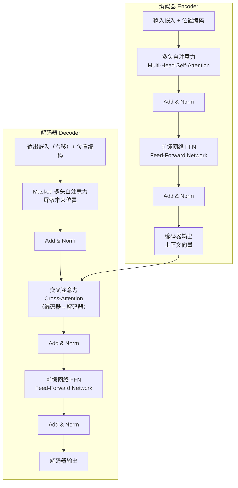

# **TensorFlow 框架**

```
TensorFlow 框架
│
├── 数据层
│    └── Tensor (张量)
│
├── 执行层
│    ├── Computation Graph (计算图)
│    ├── Ops (算子库)
│    └── 自动微分 Autodiff
│
├── 训练层
│    ├── Optimizers (优化器)
│    ├── Loss Function (损失函数)
│    └── tf.GradientTape (梯度记录)
│
├── API 层
│    ├── tf.keras (高层建模)
│    └── 低层 API (Variable, Graph)
│
├── 分布式 & 加速
│    ├── GPU/TPU 支持
│    └── tf.distribute.Strategy
│
└── 部署层
     ├── TensorFlow Serving
     ├── TensorFlow Lite
     └── TensorFlow.js

```


## 1、框架组成


### 1. **Tensor（张量）**

- 核心数据结构，相当于“多维数组”。
- 用来存储神经网络的输入、输出、权重、梯度等。
- 类似于 PyTorch 里的 `torch.Tensor` 或 Numpy 的 `ndarray`。

------

### 2. **Computation Graph（计算图）**

- 表示计算过程的抽象结构。
- 节点（Node）：一个运算（比如矩阵乘法、卷积）。
- 边（Edge）：数据依赖关系（张量在算子之间流动）。
- 优点：方便做自动微分、优化、跨设备执行。

> 早期的 TensorFlow (1.x) 强调静态图，TensorFlow 2.x 改为动态图（Eager Execution），更接近 PyTorch。

------

### 3. **Ops（算子库）**

- “算子”就是基本运算的封装。
- 包括：矩阵乘法、卷积、激活函数、池化、损失函数等。
- 底层由 C++/CUDA 实现，能在 CPU/GPU/TPU 上高效运行。

------

### 4. **自动微分（Autodiff）**

- 反向传播的引擎。
- 在计算图上应用链式法则，自动生成梯度。
- 用户只要定义 forward，框架自动给出 backward。

------

### 5. **优化器（Optimizers）**

- 负责根据梯度更新参数。
- 常见的：SGD、Adam、RMSProp。
- TensorFlow 提供了 `tf.keras.optimizers` 模块。

------

### 6. **模型构建 API**

- **低层 API**：`tf.Variable`、`tf.GradientTape`，适合科研或自定义算子。
- **高层 API**：`tf.keras`，提供 `Sequential`、`Model`、`Layer`，类似乐高积木。

------

### 7. **分布式训练（Distributed Strategy）**

- 大模型训练必须多卡、多机。
- TensorFlow 提供 `tf.distribute.Strategy`：
    - **MirroredStrategy**：多 GPU 数据并行。
    - **MultiWorkerMirroredStrategy**：多机多卡。
    - **TPU Strategy**：跑在 TPU 上。

------

### 8. **Serving & 部署**

- **TensorFlow Serving**：推理服务框架。
- **TensorFlow Lite (TFLite)**：轻量化，部署到手机/IoT。
- **TensorFlow.js**：跑在浏览器。

---


# 名词解释

## Attention

原始版本为：Single-Head Attention

扩展为：Multi-Head Attention


**Flash Attention vs Memory-Efficient Attention**

两者目标相同——**解决标准 Attention 的显存瓶颈**——但思路不一样。

### 标准 Attention 为什么慢？

标准 Attention 的计算：

> **Softmax(QKᵀ / √d) · V**

问题在于 **QKᵀ 这个矩阵**，序列长度为 N 时，它是 **N×N** 的：

- 显存占用 O(N²)，序列长 2048 还好，长到 100k 直接爆显存
- 这个矩阵需要**写回 HBM（显存）**，再读回来做 Softmax，**内存带宽成了瓶颈**，GPU 计算单元大部分时间在等数据

### Flash Attention

**核心思想：不把 N×N 矩阵写到显存，分块在 SRAM 里算完**

GPU 的存储层级：

```
SRAM（片上，超快，但很小 ~20MB）
   ↓
HBM 显存（大，但慢）
```

Flash Attention 的做法：

1. 把 Q、K、V 分成小块（tile）
2. 每次只把一小块载入 SRAM
3. **在 SRAM 里完成该块的 Attention 计算**
4. 用数学技巧（online softmax）把分块结果正确合并

**关键：整个过程 N×N 矩阵从未完整出现在显存里**

效果：

- 显存 O(N²) → **O(N)**
- 速度提升 **2~4×**（主要来自减少 HBM 读写次数）
- 数学结果和标准 Attention **完全一致**，不是近似

注：Flash Attention 简称 FA。

### Memory-Efficient Attention

Meta 提出（xFormers 库），思路不同：

**核心思想：用重计算（recomputation）换显存**

标准训练需要保存 N×N 矩阵用于 Backward，Memory-Efficient Attention 的做法是：

- Forward 时**不保存** N×N 矩阵
- Backward 时**重新计算**一遍需要的中间值

本质是一个经典权衡：

> **用计算量换显存**

效果：

- 显存大幅降低
- 速度略慢于 Flash Attention（因为重计算有额外开销）

### 对比

|          | Flash Attention           | Memory-Efficient Attention |
| -------- | ------------------------- | -------------------------- |
| 核心思想 | 分块 tiling，留在 SRAM    | 重计算，不存中间值         |
| 显存     | O(N)                      | 大幅降低但略高于 FA        |
| 速度     | **更快**（减少 HBM 访问） | 略慢                       |
| 数学精度 | 精确                      | 精确                       |
| 实现难度 | 高（需要 Triton/CUDA）    | 相对较低                   |
| 代表库   | flash-attn                | xFormers                   |

**一句话总结**

> Flash Attention = **聪明地安排计算顺序**，让数据尽量留在快速缓存里；Memory-Efficient Attention = **用时间换空间**，需要时再重算。前者更快，后者更容易实现，现在工业界基本都用 Flash Attention。

---

## AUC

​	**AUC** 是机器学习里一个非常常见的评估指标，全称是 **Area Under the Curve**，通常指 **ROC 曲线下的面积**。 

- **背景：**在二分类任务（比如广告点击预测、是否诈骗、是否患病）里，模型会输出一个概率分数 `p ∈ [0,1]`，然后根据阈值（比如 0.5）决定正负类。
     问题是：不同阈值下，模型表现会不同。AUC 就是一个综合指标，衡量模型在**所有可能的阈值**下整体的区分能力。
- **ROC** 曲线：
    - 横轴：**FPR** (False Positive Rate，假正例率)
    - 纵轴：**TPR** (True Positive Rate，真正例率 = Recall)
    - **ROC** 曲线：改变阈值，从 (0,0) 画到 (1,1)，得到一条曲线。

​	**AUC** 就是这条曲线下的面积，范围在 `[0,1]` 之间。

- **AUC** 的直观意义：

    - **AUC = 0.5**：模型跟随机猜差不多（区分不了）。
    - **AUC = 1.0**：模型完美区分正负样本。
    - **AUC > 0.9**：一般认为模型区分能力很强。

    另一个等价的解释：**AUC** 表示“从所有正样本、负样本对里，随机抽一对，模型给正样本的分数比负样本高的概率”。

    比如 **AUC**=0.8，就意味着 80% 的情况下，模型能把正样本排在负样本前面。

- 为什么推荐系统/**CTR** 预估喜欢用 **AUC**：

    - 业务目标通常是排序（把点击概率高的 item 排在前面），而不是一个固定阈值的分类。
    - AUC 衡量的正是“排序正确的概率”，比单纯的准确率 (Accuracy) 更合理。

---

## Batch

​	一组**样本（[Sample](# Sample)）**的集合，用来一次性输入模型。

- 举例：
    - batch size = 32 → 意味着你一次前向/反向会处理 32 张图片 / 32 条样本。
- **为什么要 batch**：
    - 硬件效率：GPU 更适合大块矩阵运算，不适合单个样本。
    - 稳定性：批量梯度是对真实梯度的近似，方差更小。

👉 **batch = [sample, sample, ..., sample]**。

---

## Batch Normalization（批归一化）

和 `LayerNorm` 目的一样——稳定训练、加速收敛——但**归一化的维度不同**。


### BN 怎么算？

对**同一个 batch 里所有样本的同一个特征维度**求均值和方差：

> 比如一个 batch 有 32 张图，第 5 个神经元的激活值，跨这 32 个样本做归一化

公式和 LayerNorm 一样：

> **BN(x) = γ · (x − μ_batch) / σ_batch + β**

区别是 μ 和 σ 是**跨样本**算的，而 LayerNorm 是**跨特征维度**算的。


### BN vs LayerNorm 直觉对比

```
一个 batch，形状 [样本数, 特征数]

BN：  ↓ 对每一列（每个特征）归一化，跨样本
LN：  → 对每一行（每个样本）归一化，跨特征
```


### BN 的问题

**依赖 batch size** — batch 太小时，均值和方差估计不准，效果变差

**推理时需要"运行统计量"** — 训练时会维护一个全局的移动均值和方差，推理时用这个替代 batch 统计，引入了额外状态

**不适合序列模型** — 序列长度不固定，batch 内样本差异大，BN 效果很差，所以 Transformer 用 LayerNorm 而不是 BN

---

## ckpt/checkpoint

在深度学习框架语境里，**`ckpt` = checkpoint（检查点）** 的缩写。它指的是：

👉 **在训练过程中，把模型的参数（weights）、优化器状态、甚至训练进度保存到磁盘的文件**。

> 总结：一个文件

1. **为什么要有 ckpt**
    - **断点续训**：训练几天的模型，不能因为断电/进程挂了就从头来；从最近的 ckpt 继续训练。
    - **持久化模型**：把某一时刻的参数保存下来，用于推理/部署。
    - **回溯/对比**：保存不同阶段的 ckpt，可以比较效果。
2. **ckpt 文件里一般包含什么**
    - **模型参数（weights）**：神经网络各层的权重矩阵、偏置。
    - **优化器状态（optimizer states）**：如 Adam 的动量项 (m, v)。
    - **训练进度信息**：当前 epoch、step，方便恢复训练。
    - **其他元信息**：随机数种子、配置。​

---

## CTR（点击率）

​	在推荐系统语境里，**CTR = Click-Through Rate（点击率）**。

- 什么是 **CTR**：

    - 定义：**点击数 ÷ 展示数**。
    - 举例：广告被展示 100 次，有 5 次点击 → CTR = 5%。

    它衡量了一个广告、推荐位、搜索结果 **对用户的吸引力**。

- **CTR** 预估 (**CTR prediction**)：

    在推荐系统/广告排序中，核心问题就是：
     👉 **给定用户和候选物品，预测这条内容被点击的概率是多少？**

    - 输入特征：用户画像（年龄、性别、兴趣）、上下文（时间、位置）、物品属性（类别、价格）等。
    - 模型输出：一个 [0,1] 的概率值 `p(click | user, item, context)`。
    - 训练目标：用历史点击日志做监督学习，最小化 loss（通常是二分类交叉熵）。

- 为什么 **CTR** 预测重要？

    - **广告系统**：出价 * CTR = 预期收益，CTR 是排序的核心因子。
    - **推荐系统**：高 CTR = 推荐更相关，能提升用户留存。
    - **搜索排序**：CTR 作为点击反馈信号，用来学习排序函数。

- **CTR** 和 **AUC** 的关系：

    ​	CTR 模型训练时常用的 **loss**：logloss（交叉熵）。但业务方更关心 **排序效果**：给用户推送的内容，点击概率高的是否真的排在前面？AUC（ROC 曲线下面积）正好度量了 **正样本打分比负样本高的概率**，所以在 CTR 任务里很常见。

---
## dim
**dim** 表示的是一个 tensor 中的第几维。

tensor 的维度索引从 0 开始，比如：
- 一维 tensor（形状[5]）：只有dim=0这一个维度；
- 二维 tensor（形状[3,4]）：dim=0代表行维度，dim=1代表列维度；
- 三维 tensor（形状[2,3,4]）：dim=0是第一个维度，dim=1是第二个，dim=2是第三个。

**ndim** 表示的是一个 Tensor 有几维（一般是只读属性）

---
## Dropout

本身是为了防止过拟合，作用在训练过程，方式：随机丢神经元。防止过拟合的方式还有：`Weight Decay`

训练时随机把一部分神经元的输出**置为 0**：

```
正常：  [0.5, 0.3, 0.8, 0.2]
Dropout：[0.5, 0.0, 0.8, 0.0]  ← 随机丢掉
```

**为什么有效？**

强迫网络不能依赖某几个神经元，每次都要用不同的子网络完成任务，相当于同时训练了很多个不同的网络，最终集成在一起。

**注意：推理时关掉 Dropout**，并且把输出乘以保留概率，保持数值scale一致。

## Embedding

​	在深度学习框架里，**embedding** 这个词就是 **“把离散的符号（ID、单词、类别等）映射到连续的稠密向量空间”**。

- 为什么要 **embedding **？

    - 在推荐/NLP 任务里，特征往往是 **离散的**：

        - user_id=12345
        - item_id=67890
        - word="apple"

        如果直接用 one-hot 编码：

        - 维度会非常大（几百万、几亿个 ID）。
        - 大多数维度都是 0，计算和存储都很浪费。

        **embedding 的思路**：给每个离散 ID 学一个低维稠密向量，既节省空间，又能学习到语义关系。

- **embedding** 的定义：

    - 一个 embedding 表就是一个 **矩阵** `E ∈ R^(V × d)`：

        - V = 词表/ID 空间大小（可能是 1e6 甚至 1e9）。
        - d = embedding 维度（比如 32, 64, 128）。

        给定一个 ID `i`，embedding lookup 的结果就是：

        ```
        embedding_vector = E[i]  // 第 i 行向量
        ```

---

## Epoch

​	**轮次**，把整个训练集的所有样本都训练一遍，叫做 1 个 epoch。

---

## FFN（Feed-Forward Network，前馈网络）

Transformer 每层除了 Attention，还有一个 FFN，作用是**对每个位置独立地做非线性变换**，增强表达能力。

结构非常简单，就是两层线性变换 + 一个激活函数：

```
FFN(x) = Linear₂( ReLU( Linear₁(x) ) )
```

- 第一层把维度从 d_model（如 512）**扩大**到 d_ff（如 2048，4倍）
- 激活函数引入非线性（现代模型常用 GeLU、SwiGLU）
- 第二层再**压回** d_model

关键特点：**每个 token 位置独立计算，互不干扰**（Attention 负责位置间的交互，FFN 负责每个位置自身的深度变换）。

---

## FP16 和 BF16

两者都是**16位浮点数**，相比标准的 FP32（32位）省一半显存，但表示方式不同。

三种格式对比：

|      | 总位数 | 符号 | 指数 | 尾数 |
| ---- | ------ | ---- | ---- | ---- |
| FP32 | 32     | 1    | 8    | 23   |
| FP16 | 16     | 1    | 5    | 10   |
| BF16 | 16     | 1    | 8    | 7    |

### 关键区别

**FP16** — 砍了指数位，保留了较多尾数位

- 精度更高
- 但**表示范围小**，容易溢出（数值太大直接变 inf）
- 训练时需要额外的 **Loss Scaling** 技巧防止溢出

**BF16** — 保留了和 FP32 一样的指数位，砍了尾数位

- 精度略低
- 但**表示范围和 FP32 完全一样**，不容易溢出
- 训练时不需要 Loss Scaling，更省心

现在大模型训练基本都用 BF16。

**混合精度训练**

实际训练不是全程 BF16，而是**混合使用**：

```
前向 + 反向：BF16（快、省显存）
优化器状态、主权重：FP32（精度高，更新稳定）
```

这样既享受了低精度的速度优势，又保证了参数更新的精度。

## GAUC

**GAUC = Group AUC**，即 **分组 AUC**。

- 推荐/广告场景里，样本天然是“分用户 (user) 或分 session”的。
- 如果直接算全局 AUC：
    - 大用户（有很多曝光、点击）会主导指标。
    - 小用户的体验被忽视。
- **GAUC 的思路**：
    1. 按用户 (user_id) 把样本分组。
    2. 每个用户内部算一次 AUC。
    3. 再做加权平均（常用按该用户的样本数加权）。

公式：

```
GAUC = (Σ_i (num_samples_i × AUC_i)) / Σ_i num_samples_i
```

其中 i 表示第 i 个用户。

---

## GSU

​	**Gradient Sum / Gradient Synchronization Unit**，即 **梯度累加与同步单元**。

- **出现场景**：在分布式训练（Data Parallel 或 Parameter Server 模式）里，每个 worker 都会算自己 batch 的梯度。为了更新全局参数，需要把不同 worker 的梯度 **聚合 (sum / average)**。这个“聚合模块”在不少框架里被叫做 **GSU**。
- **GSU的作用**：
    - **收集 (gather)**：收集来自多个 GPU/worker 的梯度。
    - **累加 (sum)**：把梯度加起来，得到全局梯度。
    - **规约 (reduce / average)**：除以 worker 数，得到平均梯度。
    - **分发 (scatter)**：把同步好的梯度广播/推回给各个 worker。

- **为什么要单独抽象GSU**：
    - **性能优化**：不同通信 backend（NCCL, MPI, PS RPC）都可以挂在 GSU 接口下。
    - **灵活性**：可以支持同步/异步模式。
    - **模块化**：优化器不用管分布式细节，只管调用 GSU 拿到全局梯度。

---

## KV Cache

**问题：推理时 Attention 在重复计算**

自回归生成时，每生成一个新 token，都要对**所有历史 token** 重新算一遍 K 和 V：

```
生成第1个词：计算 K,V for [token1]
生成第2个词：计算 K,V for [token1, token2]
生成第3个词：计算 K,V for [token1, token2, token3]
```

历史 token 的 K、V 每次都重算，纯粹是浪费。

**解决方法很简单：把算过的 K、V 缓存起来**

```
生成第1个词：计算并缓存 K,V for [token1]
生成第2个词：复用缓存，只计算新 token2 的 K,V
生成第3个词：复用缓存，只计算新 token3 的 K,V
```

效果是推理速度大幅提升，代价是**显存占用随序列长度增长**，这也是为什么长序列推理很吃显存。

PagedAttention（vLLM）就是专门来管理 KV Cache 显存的。

## label

在深度学习中，**label（标签）\**是指样本对应的\**真实答案**或**期望输出**。
 模型的目标，就是在输入（features）给定的情况下，让输出尽可能接近 label。

我们可以从三类典型任务里看出 label 的不同含义：

**1. 分类任务（classification）**
 比如识别图片里的猫狗。

- 输入（feature）：图片的像素矩阵
- label：类别编号，比如 `0` 表示猫，`1` 表示狗
     训练时，模型预测出一个概率分布（如 `[0.8, 0.2]`），再和真实 label（如 `1`）算 loss（常见是交叉熵）。
     换句话说，label 告诉模型「这张图其实是狗，不是猫」。

**2. 回归任务（regression）**
 比如预测房价。

- 输入：房子的面积、位置、朝向等特征
- label：真实价格，比如 `320000`
     模型输出一个实数，loss 常用均方误差（MSE），用来衡量预测值和 label 的差距。

**3. 序列或生成任务（seq2seq / generation）**
 比如机器翻译。

- 输入：英文句子
- label：正确的中文翻译
     模型需要逐词预测输出句子，让预测的 token 序列逼近 label 序列。

更底层地看：
 label 是**损失函数的监督信号**，即梯度的“方向指示器”。没有 label，模型就不知道「预测得好不好」，也无法调整权重。

换句话说：
 **features 告诉模型要“看什么”，label 告诉模型要“学到什么”。**

---

## lag（延迟）

​	**lag** 在深度学习/分布式训练框架语境下，确实通常就是 **延迟 (latency, delay)** 的意思。

- **训练里的梯度延迟（gradient lag / staleness）**

    - 在 **异步参数服务器 (async PS)** 模式下，不同 worker 速度不一样。
    - 有的 worker 已经 push 新梯度，有的 worker 还在用旧参数。
    - 这会导致 **梯度延迟 (lag)**：模型在更新时用的不是最新的全局参数，而是落后若干 step 的版本。
    - 相关概念：**stale gradient**。

    👉 在论文里经常看到 *“lag of k steps”*，就是参数延迟了 k 个迭代才更新上去。

- **系统通信/计算延迟 (system lag)**

    - 分布式训练时，通信（allreduce / remote_gsu）需要时间。
    - 如果通信没和计算 overlap，就会出现 **同步等待的 lag**。
    - 类似：某个 GPU 算完了，却要等别的 GPU → 训练整体卡住。

- **数据管道的延迟 (data lag)**

    - 数据读取/预处理速度跟不上训练速度，GPU 等不到 batch。
    - 这时也叫 lag（数据延迟）。
    - 解决方法：多线程/异步加载，或者 `mio/shuffle2` 优化。

---

## Layer Normalization(层归一化)

和 `BatchNrom` 目的一样——稳定训练、加速收敛——但**归一化的维度不同**。

**目的：** 稳定训练，加速收敛，防止内部协变量偏移。

**做法：** 对**同一样本的所有特征维度**做归一化（均值→0，方差→1），再用可学习参数 γ、β 缩放和平移：

> **LayerNorm(x) = γ · (x − μ) / σ + β**

对比 Batch Norm（对一批样本的同一维度归一化），LayerNorm **不依赖 batch size**，对序列模型更友好。

在 Transformer 里，残差 + LayerNorm 组合成固定搭配：

```
输出 = LayerNorm(x + SubLayer(x))
```

---

## logits

一般是指：**模型最后一层输出的“原始分数（raw score）”**，还没有经过 `sigmoid`。

也就是说，`logits` 的取值范围为 **(-∞, +∞)** 

`sigmoid(logits)` 才会变成概率。

---

## metric

1. **metric 的定义**
- **metric**（评估指标）：用来评价模型在训练集 / 验证集 / 测试集上的表现。
  
- 它通常是**和业务目标更接近的指标**，比如准确率、AUC、F1。
  
- 不参与反向传播（梯度更新），只用于**监控和报告**。


2. **metric vs loss**

- **loss**：训练目标函数，用来算梯度，指导模型更新。
    - 比如交叉熵 (cross-entropy loss)。
- **metric**：用来监控训练进度/模型效果，判断是否收敛、是否过拟合。
    - 比如 accuracy、precision、recall、AUC。

👉 举个例子：

- 你训练 CTR 预估模型：
    - **loss** = logloss (二分类交叉熵)
    - **metric** = AUC、Accuracy
- 优化器只关心 logloss；
- 你和业务方更关心 AUC（排序效果）。

---

## MCP

MCP（Model Context Protocol）是 Anthropic 推出的开放协议，旨在标准化 AI 模型与外部工具、数据源之间的连接方式。

### 核心概念

可以把 MCP 理解为 AI 世界的"USB 接口"——有了统一标准，任何工具只要实现这个协议，就能即插即用地接入 AI 模型，而不需要为每个模型单独开发集成。

### 解决了什么问题

传统方式下，每当你想让 AI 访问一个外部系统（比如数据库、GitHub、Slack），开发者需要为每个 AI 模型单独写一套连接代码。MCP 统一了这套接口，一次实现，到处可用。

### 架构组成

**三个角色：**

- **Host（宿主）**：运行 AI 的应用，如 Claude Desktop、IDE 插件
- **Client（客户端）**：宿主内部负责与 MCP Server 通信的模块
- **Server（服务端）**：对外暴露工具和数据的独立进程，比如"GitHub MCP Server"

**Server 能提供三类能力：**

- **Tools（工具）**：可执行的操作，如搜索、创建文件、发送消息
- **Resources（资源）**：可读取的数据，如文件内容、数据库记录
- **Prompts（提示）**：预定义的提示模板

### 典型使用场景

- 让 Claude 直接读写你的 Google Drive 文件
- 在 IDE 中让 AI 助手查询 Jira 工单
- 连接本地数据库，让模型直接查询数据
- 集成 Slack、GitHub、Notion 等常用工具

## MFU（模型浮点运算利用率）

👉 **MFU = Model FLOPs Utilization（模型浮点运算利用率）**

1. **它是什么**

    - 衡量一个训练/推理任务 **实际执行的算力** 和 **理论峰值算力** 的比例。
    - 通常用来描述 GPU/TPU 在训练大模型时的 **计算效率**。

    公式大致是：
    $$
    MFU = \frac{\text{实际完成的 FLOPs}}{\text{理论峰值 FLOPs}}
    $$

2. **举个例子**

    假设一张 A100 GPU：

    - 理论峰值：312 TFLOPs (FP16 TensorCore) （ps：这个数据是硬件参数信息）

    - 你跑一个大模型，统计下来实际只用了 156 TFLOPs

    - 那么：
        $$
        MFU = 156 / 312 = 50\%
        $$

    说明硬件只跑出了 50% 的算力。

3. 为什么会低

    MFU 不可能一直接近 100%，原因有：

    - **显存带宽不足**：大量时间花在搬数据。
    - **通信开销**：分布式 allreduce、remote_gsu、参数同步。
    - **kernel launch 开销**：小 op 太多，GPU 没法高效利用。
    - **稀疏计算**：embedding lookup、稀疏梯度更新，算力利用率先天不足。

---

## MoE（Mixture of Experts）

该操作发生在 forward 阶段。

**核心思想：不是每次都用全部参数**

普通 Dense 模型，每个 token 过每一层时，**所有参数都参与计算**。

MoE 把 FFN 层替换成多个"专家"（Expert），每次只激活其中几个：

```
普通 FFN：
token → 一个大 FFN → 输出

MoE：
token → Router（路由器）→ 选2个Expert → 加权合并 → 输出
        ↗ Expert 1 ↘
        → Expert 2 →
        ↘ Expert 3 ↗
          Expert 4
          ...
          Expert N
```

**Router** 是一个小网络，决定每个 token 该去哪几个 Expert。

------

### MoE 的好处

**参数多但计算量不变**

比如有 8 个 Expert，每次只激活 2 个：

- 总参数量是 Dense 模型的 **8倍**（模型更有表达力）
- 实际计算量只有 **2/8 = 25%** 的 Expert 参与

所以 MoE 能用**更少的计算量**达到**更大模型**的效果。

------

### MoE 的问题

**负载均衡** — Router 容易偷懒，总把 token 发给同几个 Expert，其他 Expert 闲置，训练时需要加辅助 loss 强制均衡

**显存大** — 虽然计算量小，但所有 Expert 的参数都要加载到显存，所以部署成本高

**通信开销** — 分布式训练时，不同 Expert 可能在不同 GPU 上，token 路由涉及大量跨卡通信

## MPI

**MPI（Message Passing Interface）** 是一个**并行计算的通信标准**，专门用于让多个进程之间互相传递消息、协同完成计算任务。

它不是一个软件，而是一套**规范/接口标准**，有多种实现：

- **OpenMPI** — 最常用的开源实现
- **MPICH** — 另一个主流开源实现
- **Intel MPI** — Intel 提供的高性能实现

**典型使用场景：**

- 科学计算（气候模拟、物理仿真）
- 机器学习分布式训练
- 高性能计算（HPC）集群
- 大规模矩阵运算

------

### mpirun 是什么

`mpirun` 是 MPI 的**启动器命令**，用来同时启动多个并行进程来运行你的程序。

bash

```bash
mpirun -np 4 ./my_program
#        ↑
#     启动 4 个进程并行运行
```

**常用参数：**

| 参数                   | 含义               |
| ---------------------- | ------------------ |
| `-np 4`                | 启动 4 个进程      |
| `-host node1,node2`    | 在指定机器上运行   |
| `--hostfile hosts.txt` | 从文件读取节点列表 |
| `-mca ...`             | 传递组件配置参数   |

## pieline（流水线）

在深度学习框架里，**pipeline（流水线）** 这个词非常常见，但要看语境。核心含义就是：
 👉 **把一整个大任务拆成多个环节（stage）。**

1. 数据处理 pipeline

- 典型于 `Dataset → Shuffle → Batch → Prefetch`。
- 一边读数据、一边预处理、一边训练 → CPU 和 GPU 能并行，不让 GPU 饿死。
- TensorFlow 的 `tf.data`、PyTorch 的 `DataLoader` 背后都有 pipeline 思想。

例子：

```
Reader  →  Shuffle  →  Parse  →  Batch  →  Train
```

---

## ps/PS

一般是指 **参数服务器。**

- **什么是 Parameter Server (PS)**：在分布式训练里，参数服务器是一种经典架构。

    - **Worker节点**：负责前向/反向，算梯度。
    - **PS 节点**：负责存储全局参数，接收梯度并更新，再把最新参数发回给 worker。

    这种模式在早期的 **大规模推荐系统 / embedding 模型** 里特别常见，因为 embedding 表可能有几十亿条，放不下单卡，需要分布式存储和更新。

- **ps 目录通常包含的内容**：

    1. **通信层**
        - 定义 RPC 或 RPC-like 接口（push/pull 参数、拉取梯度、参数广播）。
        - 可能有 gRPC、ZMQ、MPI、RDMA 等实现。
    2. **参数存储**
        - 大量参数表（尤其是 embedding），可能是哈希表、分块数组。
        - 提供接口：`Pull(keys)` 拉参数，`Push(keys, grads)` 更新参数。
    3. **优化器逻辑（服务端版本）**
        - 在 PS 上实现的 SGD/Adam/FTRL 等优化器。
        - worker 只传梯度，优化完全在 PS 上完成。
    4. **一致性/调度策略**
        - 同步模式（同步 SGD）：所有 worker 算完梯度再一起更新。
        - 异步模式（async SGD）：worker 直接 push，PS 异步更新。
        - 半同步（bounded staleness）：允许一定延迟。
    5. **分布式管理**
        - 参数分片（shard），不同 PS 进程各存一部分参数。
        - 路由逻辑（某个 key 属于哪台 PS）。

> 在早期的 TensorFlow 1.x 就有 ps 角色，后来逐渐淡出，被AllReduce/NCCL ring-based 替代。

---

## recycle特征过滤

**recycle 特征过滤（recycle feature filtering）**通常指的是一种**在特征生命周期管理中对“陈旧、不活跃特征”进行清理或过滤的机制**，以节省内存、存储和计算资源。

如果不进行特征过滤，有可能会导致以下情况：

- OOM，无用特征占用机器资源
- embedding table 查找和更新效率变慢
- checkpoint/model 保存时间过长

---

## Sample

​	**样本**，训练/推理中的一个**最小单位输入**。

- 举例：
    - 图像分类 → 一张图片 + 它的标签 (label)。
    - 推荐系统 → 一条用户点击记录（user_id, item_id, 特征，点击=0/1）。
    - NLP → 一句话或一个 token 序列。

👉 **样本是单个实例**。

---

## shape
shape 是指一个 tensor 的形状，也就是指一个多维数组的形状。
示例：
```python
import numpy as np
x = np.array([1, 2, 3])
print(x.shape) # 输出 (3,)

x = np.array([[1, 2, 3], 
              [4, 5, 6]])
print(x.shape) # 输出 (2, 3)

x = np.array([[[1, 2, 3], [4, 5, 6]], 
              [[7, 8, 9], [10, 11, 12]]])
print(x.shape) # 输出 (2, 2, 3)
```
---
## Shuffle

​	**打乱样本数据。**在训练里，如果数据样本按原始顺序输入（比如用户 ID 排序、时间顺序），模型会学到“伪规律”，收敛效果差。打乱样本顺序，让每个 batch 更接近独立同分布 (i.i.d.)，提升泛化。**注**：一般在 Dataset → Reader 阶段做。

---

## sign/signature（特征签名）

​	**signature（特征签名）**，即某个 embedding 特征 ID 的 **唯一数值标识**。

1. **为什么需要 sign**

​	在工业推荐系统里：

- feature 的原始值可能是字符串/类别值，比如 `"user:12345"`、`"item:ABCD"`。
- 如果直接拿字符串当 key 查 embedding，代价太高。
- 所以框架通常会做 **特征哈希 (feature hashing)** → 把字符串映射成一个 **64-bit 整数**，这个数就叫 **sign**。

2. sign 在 embedding lookup 里的作用

    - **sign = embedding 表的索引 key**。
    - `pullSparse` 的时候，worker 会传一批 sign 给参数服务器 → 参数服务器根据 sign 查 embedding 向量。
    - `pushSparse` 的时候，梯度也是和 sign 一起传回去，PS 才知道要更新哪条 embedding。

---

## slot（槽位）

​	**slot** 是特征**的容器 / 位置**，框架里用来表示一类特征的归属。

- 比如：
    - slot0 → user_id
    - slot1 → item_id
    - slot2 → age
    - slot3 → gender

👉 可以简单理解：

- slot = 特征的“字段名”
- feature = 具体的“取值”

> 一般来说，每一个 slot 都会对应一个 embedding 表。

---

## step/itreator

在深度学习训练语境下，**step** 就是训练循环里的最小单位 —— **一次迭代（iteration）**。

> 多机多卡的分布式训练里，**一个 step 是所有 worker 协同完成的**，也就是说 step 是一个全局的概念。

1. **step 的定义**

    - **一个 step = 用一个 batch 的数据完成一次前向传播、一次反向传播、一次参数更新**。

    - step 和 [epoch](# Epoch) 的关系：

        ```
        1 epoch = (训练集样本数 ÷ batch_size) 个 step
        ```

2. **每个 step 里包含的工序**

    1. **取数据**
        - 从 Dataset/Reader 里取出一个 batch 样本（大小 = batch_size）。
        - 可能还包含 shuffle、预处理、数据增强。
    2. **前向传播 (forward pass)**
        - 把这个 batch 喂进模型，逐层计算输出预测值 (pred)。
    3. **计算 loss**
        - 用预测值 pred 和真实标签 y，算损失函数 (loss)。
        - 比如分类任务的交叉熵，回归的均方误差。
    4. **反向传播 (backward pass)**
        - 根据 loss 对模型参数求导（∂loss/∂W）。
        - 计算出梯度 (gradients)。
    5. **梯度聚合（分布式可选）**
        - 如果是多 GPU/多机训练，还要做 **梯度同步/聚合**（allreduce 或 push/pull 到 PS）。
    6. **参数更新 (optimizer step)**
        - 优化器（SGD/Adam 等）根据梯度更新参数。
        - 例如：`W ← W - lr * grad`。
3. 举个例子：batch_size=128
    - **Step 1**：取 128 张图 → forward → loss → backward → 更新参数
    - **Step 2**：取下一个 128 张图 → 同样流程
    - …
    - 重复到覆盖完整个训练集，就是 1 个 epoch。

---

## Tensor

- **定义**：数学上是多维数组；框架里就是“带有 `shape + dtype` 的数据块”。
- 在深度学习训练中，**[样本](# Sample) 和 [batch](# Batch) 最终都要转成张量形式，才能送进模型计算**。
- 举例：
    - 单张灰度图：shape = `[28, 28]` 的 tensor。
    - 32 张灰度图 batch：shape = `[32, 28, 28]` 的 tensor。
    - 如果是彩色图像（3 通道）：单张 = `[3, 28, 28]`，batch = `[32, 3, 28, 28]`。

👉 **张量是数据的数学/计算表示形式**。

---

## tf.assign_add

`tf.assign_add` 就是**原地加法**，把一个变量加上某个值并保存回去：

```python
x = tf.Variable(0)
x.assign_add(1)   # x = x + 1，现在 x = 1
```

**作用**

普通的加法在 TensorFlow 里会**创建新的 tensor**，不会修改原变量：

```python
x = tf.Variable(0)
x = x + 1    # 创建了新 tensor，原变量没变
```

`assign_add` 是**原地修改**，不创建新 tensor，直接改变量的值。

## Variable

在深度学习框架中，**Variables（变量）** 通常指**可训练的张量（Tensor）**，是模型参数的载体。

**典型例子**

| 参数类型       | 说明                            |
| -------------- | ------------------------------- |
| 权重矩阵 W     | 全连接层、卷积核等              |
| 偏置 b         | 各层的偏置项                    |
| BatchNorm 参数 | γ、β、running_mean、running_var |
| Embedding 矩阵 | 词向量表                        |

**TensorFlow 1.x**（最早明确提出这个概念）

```python
W = tf.Variable(tf.zeros([784, 10]), name="weights")
b = tf.Variable(tf.zeros([10]), name="bias")
```

**PyTorch**（用 `nn.Parameter` 表示可训练变量）

```python
self.weight = nn.Parameter(torch.randn(in_features, out_features))
# nn.Parameter 本质上是 requires_grad=True 的 Tensor
```

TensorFlow 2.x / Keras

```python
self.kernel = self.add_weight(shape=(input_dim, units), trainable=True)
```

与普通张量的区别

```python
普通 Tensor  →  计算图中的中间值，用完即弃
Variable     →  持久存在，随训练不断更新，代表模型"学到的知识"
```

---

## Warmup

本身是为了训练稳定性。

**问题：训练最开始参数是随机初始化的**

这时候梯度很不稳定，如果一上来就用很大的学习率，容易把模型"训崩"——参数更新太大，Loss 直接飞掉。

**做法：学习率从一个很小的值慢慢涨到目标值**

```
学习率
  ↑
max_lr ─────────────────╮（之后可以再慢慢降）
                                    │
                                   /
                                  /
                                 /
0 ──────────────────/
        Warmup 阶段
```

Warmup 阶段通常是总训练步数的 **1%~5%**，让模型先在稳定状态下找到大致方向，再加速。

## Weight Decay

防止过拟合，作用在参数本身，通过惩罚大权重实现。防止过拟合的手段还有 `Dropout`。

**问题：模型参数可能变得很大**

训练时模型为了拟合数据，某些权重可能会变得非常大，导致**过拟合**——在训练集上表现好，泛化差。

**做法：每次更新参数时，顺便把参数往 0 拉一点**

普通更新：

> θ = θ − lr × grad

加了 Weight Decay：

> θ = θ − lr × grad **− lr × λ × θ**

多了最后一项，每次都把参数缩小一点点，防止权重无限膨胀。

**直觉上：** 模型参数小而分散，比大而集中更健康，泛化性更好。

## Worker

​	**Worker = 执行训练任务的进程/角色**。Worker 最常见的就是使用一个独立进程表示。

> 哪怕有多个worker，step也是同步训练的。多机多卡的分布式训练里，**一个 step 是所有 worker 协同完成的**，也就是说 step 是一个全局的概念。

它负责：

- 拿数据（batch）
- 前向计算 (forward)
- 反向传播 (backward)
- 产生梯度 (gradients)
- 把梯度交给参数服务器（PS）或者做 allreduce

> **AllReduce 就是分布式系统里“大家算完各自的一份，然后合起来，再让每个人都有最终结果”的高效算法**。

Worker 本身并不一定存储全局参数，而是**用参数、算梯度、推回去**。

---
## Xavier

**Xavier** 初始化（Glorot 初始化）是深度学习中最经典的权重初始化方法，核心是通过控制权重方差，让网络前向 / 反向传播时信号（激活值、梯度）的方差保持稳定，缓解深层网络的梯度消失 / 爆炸问题。

一、核心思想
**方差一致性**：
- 前向：每层输出方差 ≈ 输入方差
- 反向：每层梯度方差 ≈ 输入梯度方差

    避免深层网络中信号指数级放大 / 缩小。

二、数学公式（权重 W）
设：

- nin：当前层**输入神经元数**
- nout：当前层**输出神经元数**

1. 均匀分布（常用）
$$
  W \sim \mathcal{U}\left(-\sqrt{\frac{6}{n_{in}+n_{out}}},\ \sqrt{\frac{6}{n_{in}+n_{out}}}\right)
$$

2. 正态分布

$$
W \sim \mathcal{N}\left(0,\ \frac{2}{n_{in}+n_{out}}\right)
$$

三、适用场景
✅ **推荐**：
- 激活函数：**Sigmoid / Tanh**（对称、饱和型）

- 网络：全连接层（MLP）、早期 CNN


❌ **不推荐**：

- ReLU / Leaky ReLU 等非对称激活 → 改用 **He (Kaiming) 初始化**

---
## 残差

**残差链接（Residual Connection）**

神经网络越深，训练越难——梯度在反向传播时会消失或爆炸。残差连接（ResNet 提出）通过"跳跃连接"解决这个问题：

**核心思想：** 不让网络直接学映射 H(x)，而是学**残差** F(x) = H(x) − x，输出变成：

> **输出 = F(x) + x**

好处是梯度可以直接通过加法"跳过"某些层流回去，训练深层网络变得稳定得多。在 Transformer 里，每个子层（Attention、FFN）后面都有残差连接。

## 同步训练

流程可以想象成一群学生做题：大家写完后统一交卷，等到最后一个人交卷，老师才公布答案。

**机制**：

- 每个 worker（GPU/节点）在本地算出梯度。
- 所有 worker 把梯度聚合（比如 AllReduce，或者发给参数服务器）。
- 等到所有 worker 的梯度都收集齐，参数更新一次，大家拿到同样的最新参数，再进入下一步。

**优点**：

- 参数一致性强：所有 worker 在同一轮里用的模型权重完全一样。
- 收敛性好：训练过程接近单机的数学性质，更稳定。

**缺点**：

- **慢节点拖累整体**：如果有个 worker 特别慢（叫 *straggler*），大家都得等它。
- 扩展性差：机器越多，等待越明显。

## 异步训练

**机制**：

- 每个 worker 算出梯度后，立即发送给参数服务器（PS）。
- 参数服务器收到梯度就立刻更新参数，不等其他 worker。
- Worker 随时拉取最新的参数继续训练。

**优点**：

- 没有“慢节点拖累”问题：worker 各自独立，效率高。
- 扩展性好：节点多时，整体吞吐量更高。

**缺点**：

- 参数不一致：有些 worker 可能用的还是“旧模型”，更新的延迟导致训练过程更 noisy。
- 收敛性变差：理论上可能收敛到次优解，或者需要调低学习率来稳定。

---

## 过拟合和欠拟合

1. **过拟合 (Overfitting)**

    - **定义**：模型在训练数据上表现很好，但在测试数据（未见过的数据）上表现差。

    - **本质**：模型记住了训练集的“细节和噪声”，而不是学到了普遍规律。

    **现象**

    - 训练误差 **持续下降**

    - 验证/测试误差 **先下降后上升**

    - 指标（如准确率、AUC）在训练集上高，但在验证集上低

    **解决办法**

    - 正则化（L1/L2，Dropout）

    - 数据增强（增加训练样本多样性）

    - 提前停止 (early stopping)

    - 简化模型（降低参数量）


2. **欠拟合 (Underfitting)**

    - **定义**：模型在训练集和测试集上都表现不好。

    - **本质**：模型太简单，无法捕捉数据的真实规律。

    **现象**

    - 训练误差 **一直很高**，下降缓慢或停滞
    - 验证误差同样高
    - 模型没有学会足够的模式

    **解决办法**

    - 使用更复杂的模型（增加层数、参数量）

    - 调整特征工程（更好的输入特征）

    - 训练更久，学习率调优

## FAQ

### 1. shape 和 dim 的区别
shape 描述了一个多维数组的形状。dim 则是表示这个多维数组的第几维度。
示例：
```python
"""
注：在 numpy 中，axis 就是 dim 的意思
"""

import numpy as np

# 对于一个二维数组
arr = np.array([[1, 2, 3], 
                [4, 5, 6]])
# shape 为 (2, 3)
# 对dim=0（行维度/垂直方向）求和：把每一列的元素相加
sum_dim0 = arr.sum(axis=0)  # 等价于 [1+4, 2+5, 3+6]
print("dim=0求和：", sum_dim0)  # 输出 [5 7 9]

# 对dim=1（列维度/水平方向）求和：把每一行的元素相加
sum_dim1 = arr.sum(axis=1)  # 等价于 [1+2+3, 4+5+6]
print("dim=1求和：", sum_dim1)  # 输出 [6 15]


# 对于一个三维数组：shape=(2, 3, 4) → 2页、3行、4列
arr3 = np.array([
    # 第0页（axis=0的第0个元素）：3行4列
    [[1, 2, 3, 4],   # 第0页第0行
     [5, 6, 7, 8],   # 第0页第1行
     [9, 10, 11, 12]],# 第0页第2行
    # 第1页（axis=0的第1个元素）：3行4列
    [[13, 14, 15, 16],# 第1页第0行
     [17, 18, 19, 20],# 第1页第1行
     [21, 22, 23, 24]] # 第1页第2行
])

# axis=0求和：2页合并，消除页维度，结果shape=(3, 4)（只剩3行4列）
sum_axis0 = arr3.sum(axis=0)
print("axis=0求和结果shape：", sum_axis0.shape)  # 输出 (3, 4)
print("axis=0求和结果：\n", sum_axis0)
# 输出：
# [[14 16 18 20]  → 1+13, 2+14, 3+15, 4+16
#  [22 24 26 28]  → 5+17, 6+18, 7+19, 8+20
#  [30 32 34 36]] → 9+21, 10+22, 11+23, 12+24

# axis=1求和：每一页内按行求和，消除行维度，结果shape=(2, 4)（2页、4列）
sum_axis1 = arr3.sum(axis=1)
print("axis=1求和结果shape：", sum_axis1.shape)  # 输出 (2, 4)
print("axis=1求和结果：\n", sum_axis1)
# 输出：
# [[15 18 21 24]  → 第0页：1+5+9, 2+6+10, 3+7+11, 4+8+12
#  [51 54 57 60]] → 第1页：13+17+21, 14+18+22, 15+19+23, 16+20+24

# axis=2求和：每一页的每一行按列求和，消除列维度，结果shape=(2, 3)（2页、3行）
sum_axis2 = arr3.sum(axis=2)
print("axis=2求和结果shape：", sum_axis2.shape)  # 输出 (2, 3)
print("axis=2求和结果：\n", sum_axis2)
# 输出：
# [[10 26 42]   → 第0页：1+2+3+4, 5+6+7+8, 9+10+11+12
#  [58 74 90]]  → 第1页：13+14+15+16, 17+18+19+20, 21+22+23+24
```
---


# 训练流程

1. **准备数据**

    - 先把原始数据分成三份：

        - **训练集**：模型用来学习。
        - **验证集**：训练过程中用来检查模型效果，防止模型只记住训练数据。
        - **测试集**：训练结束后才用，检验模型最终表现。

    - 数据通常要**打乱顺序**（避免模型学到数据排列的规律），**分小批量**（mini-batch，比如一次喂给模型 64 条数据），还会做**数据增强**（图像可以翻转、裁剪，文本可以随机丢掉某些词），让模型更有“抗干扰能力”。

    - 注意数据泄漏（归一化的均值方差只用训练集计算）。

        > 注意：数据增强不是所有任务都做增强，比如推荐系统、结构化数据，增强方式和图像/文本完全不同。

2. **初始化参数**

    - 模型刚开始时，权重（就是需要学习的数字）不能全设为 0，会导致没法学习。
    - 所以通常会用一些“聪明的随机数”初始化，让模型能顺利开始学习，不至于一上来就梯度消失或者爆炸。
    - 线性/Conv 层通常用 Xavier(Glorot) 或 He(Kaiming) 初始化，匹配激活函数的方差尺度，减少梯度爆炸/消失。
    - 偏置一般 0 初始化；嵌入/LayerNorm/BN 等各有默认策略。

3. **一次训练的基本步骤**（针对一小批数据）：

    - **前向计算（forward）**：把输入数据传进模型，得到输出结果。

    - **损失计算（loss）**：把模型输出和真实答案比较，得到“差距”是多少（损失函数就是衡量这个差距的方法，比如分类用交叉熵，回归用平方差）。

    - **反向传播（backward）**：根据损失，往回算出模型里每个参数需要怎么调整（求导，链式法则）。

    - **优化器更新（optimizer step）/用梯度更新参数**：

        - SGD：`θ ← θ - η·g`
        - Momentum/Adam/AdamW：用一阶矩、二阶矩与**解耦权重衰减**（AdamW）更稳定。
        - 常配 **梯度裁剪**（clipping）抑制爆炸。

        > 另一种说法：
        >
        > **参数更新**：用优化算法（比如最简单的梯度下降）去更新权重：
        >  参数 ← 参数 - 学习率 × 梯度。
        >  学习率就是每一步走多大。

    - **学习率调度（scheduler）**：warmup→恒定/余弦衰减/Plateau 降速等。

4. 混合精度与梯度累积（可选）

    - **AMP**：前向用 FP16/BF16，反向带损失缩放（loss scaling），显著提速省显存。

    - **梯度累积**：堆叠多步的梯度再更新，等效放大 batch size。

        > 混合精度在 GPU 上常见，CPU 上基本没必要。
        >
        > 梯度累积常用于 **显存不够时**（比如 batch_size 想设大，但卡装不下）。

5. 验证与监控

    - 每个若干 step/epoch 在 **验证集**评估指标（准确率、F1、AUC、Perplexity…），不更新梯度。

    - 记录曲线（loss/metric/学习率/梯度范数），保存 checkpoint（最好含优化器与调度器状态）。

        > 最好保存“最优验证集表现的模型”，而不是只保存“最后一次训练的模型”。

6. 训练停止与“收敛”的现实定义

    - 实务上用以下之一或组合：
        - 训练损失不再显著下降（或梯度范数接近 0）。
        - **验证指标**在若干轮（patience）内无提升（早停 Early Stopping）。
        - 达到预算上限（时间/算力/epoch）。
        - **预设 epoch 数**（比如 100 epoch），就算模型还没完全收敛，也先停。这样保证训练成本可控。

    - 重点：**泛化**优先于把训练损失磨到极小；过拟合时看验证集曲线与正则化手段。

# 激活函数

​	在神经网络里，**激活函数（Activation Function）** 是加在每一层神经元输出上的“非线性变换函数”。它的作用就像电路里的“开关”，决定信号能不能、以及以怎样的强度传到下一层。

**数学定义**

假设神经网络某一层的线性输出是：$z = Wx + b$，其中 $W$ 是权重矩阵，$x$ 是输入向量，$b$ 是偏置。

激活函数 $\sigma(\cdot)$ 定义为：$a=σ(z)$。这里 $a$ 就是经过激活后的输出。

**为什么要有激活函数**

如果没有激活函数，网络只是不断做线性变换（矩阵乘加），哪怕叠再多层，结果还是一个**大线性函数**，表达能力有限。
激活函数引入非线性，让网络能逼近复杂函数，从而具备拟合非线性数据的能力。

**常见激活函数**

## Sigmoid

$$
\sigma(x) = \frac{1}{1+e^{-x}}
$$

​	输出在 $(0,1)$，常用于二分类，但有梯度消失问题。

## Tanh

$$
\sigma(x) = \tanh(x) = \frac{e^x - e^{-x}}{e^x + e^{-x}}
$$

​	输出在 $(-1,1)$，相比 Sigmoid 更居中。

## ReLU

$$
\sigma(x) = \max(0, x)
$$

目前最常用，简单高效，但负区间会“死神经元”。

## Leaky ReLU

$$
\sigma(x) = 
\begin{cases} 
x, & x \ge 0 \\
\alpha x, & x < 0
\end{cases}
$$

​	缓解 ReLU 死亡问题。

## Softmax

$$
\sigma(z_i) = \frac{e^{z_i}}{\sum_j e^{z_j}}
$$

常用于多分类，把输出转成概率分布。其中：

- $z_i$ 表示第 i 个类别的原始输入值

# 损失函数

## 均方误差

$$
E=\frac{1}{2}\sum_k({y_k-t_k})^2
$$

​	这里，$y_k$ 是表示神经网络的输出，$t_k$ 是表示监督数据，$k$ 是表示数据的维度。

## crossEntropyLoss(交叉熵误差)

$$
E=-\sum_{k}t_k\log y_k
$$
其中：

- $y_k$ 是神经网络的输出
- $t_k$ 是正确解标签。$t_k$ 中只有正确解标签的索引为 1，其他均为0（one-hot表示）。

## BCEWithLogitsLoss

$$
L = -\left( y \log p + (1-y)\log(1-p) \right)
$$

其中：

- $y∈\{0,1\}$
- $p$ 是预测概率

在 `BCEWithLogitsLoss` 中，

```c++
p = sigmoid(x)
```

# Transformer




### Transformer 的核心思想

传统 RNN 是**串行**处理序列的，速度慢、长距离依赖弱。Transformer 的创新在于用**注意力机制**完全替代了循环结构，所有位置**并行计算**。

------

### 两大组成部分

**编码器（Encoder）** — 理解输入 把输入序列（如英文句子）压缩成一组上下文向量，捕获每个词与其他词的关系。

**解码器（Decoder）** — 生成输出 根据编码器的上下文，逐步生成输出序列（如翻译后的中文）。

------

### 关键模块

**多头注意力（Multi-Head Attention）** — 核心中的核心，让每个词都能"看到"序列中所有其他词，并计算它们之间的相关性权重。多个"头"并行运行，从不同角度理解关系。

**Masked 自注意力** — 解码器专用，生成时屏蔽未来的位置，防止"偷看答案"。

**交叉注意力（Cross-Attention）** — 解码器用来查询编码器输出的机制，这是两者之间的信息桥梁（图中橙色虚线）。

**FFN + Add & Norm** — 每个注意力层后都跟前馈网络做非线性变换，再用残差连接 + LayerNorm 稳定训练（图中虚线箭头）。

**位置编码（Positional Encoding）** — 注意力本身没有位置感，需要在输入中手动注入位置信息。

# 最基础的神经网络MLP

**MLP（多层感知机, Multi-Layer Perceptron）** 是最基础的神经网络：

- 输入层：接收输入数据（比如一张 28×28 的手写数字图片）。
- 隐藏层：若干个线性变换 + 非线性激活函数（ReLU）。
- 输出层：输出分类结果（10 个类别，对应 0–9）。

公式上可以写成：
$$
h = \text{ReLU}(W_1 x + b_1)
$$
其中：

- $x$：输入向量（图片摊平成 784 维）。
- $W_1, W_2$：权重矩阵，需要训练。
- $b_1, b_2$：偏置向量，需要训练。
- ReLU：激活函数，把负数压成 0，让网络有非线性表达能力。