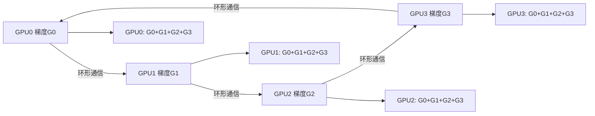

## C++
### folly
folly 是 Facebook（现 Meta）开源的一款功能强大的 C++ 库。
地址：https://github.com/facebook/folly

folly（全称 Facebook Open-source Library）是 Meta 为大规模高性能 C++ 应用开发打造的基础库，是一套综合性的 C++ 工具集，填补了 C++ 标准库在高性能场景下的不足，广泛用于 Meta 内部的服务端、移动端等核心系统。

folly 包含了大量实用且高性能的组件，核心模块包括：
- **基础数据结构**：如高性能的字符串处理（fbstring）、动态数组（dynamic）、无锁队列（MPMCQueue）等；
- **并发与线程**：轻量级线程（fibers）、原子操作、线程池、同步原语（如SharedMutex）；
- **网络与 IO**：异步 IO、HTTP 客户端 / 服务端、字节流处理；
- **内存管理**：高效的内存分配器（jemalloc封装）、对象池；
- **工具类**：日志、异常处理、配置解析、性能监控等。

该库：
- 适配 C++11 及以上标准，对高性能、低延迟、高并发场景做了极致优化；
- 依赖较少（主要依赖系统库和 jemalloc），但对编译环境要求较高（需 GCC 7+、Clang 6 + 等）；
- 主要用于服务端开发，不推荐在移动端等资源受限场景直接使用（体积较大）。

### glog
glog（Google Logging Library）是谷歌开源的一款轻量级、高性能的 C++ 日志库。
**glog 的核心特性**：
- **日志分级**：支持 DEBUG/INFO/WARNING/ERROR/FATAL 5 个级别，可灵活控制输出哪些级别的日志；
- **日志轮转**：自动按文件大小 / 时间切割日志文件，避免单个日志文件过大；
- **线程安全**：多线程环境下日志输出不混乱，无需额外加锁；
- **丰富的格式化**：支持类似 printf 的格式化输出，还能自动记录文件名、行号、时间、进程 / 线程 ID；
- **便捷的宏定义**：通过简单的宏（如 LOG(INFO)）即可输出日志，使用成本极低；
- **自定义配置**：可配置日志输出路径、级别过滤、是否输出到控制台等。

**安装**
```bash
# 以 Ubuntu 为例
sudo apt-get install libgoogle-glog-dev
```

**使用示例**：
```c++
#include <glog/logging.h>  // 引入glog头文件

int main(int argc, char* argv[]) {
    // 1. 初始化glog：参数为程序名，会自动处理命令行参数（如--log_dir指定日志路径）
    google::InitGoogleLogging(argv[0]);

    // 2. 配置日志（可选）
    // 设置日志输出目录（需确保目录存在）
    FLAGS_log_dir = "./logs";
    // 只输出 WARNING 及以上级别的日志（DEBUG/INFO 会被过滤）
    // FLAGS_minloglevel = google::WARNING;
    // 日志同时输出到控制台（默认开启）
    FLAGS_alsologtostderr = true;
    // 按文件大小轮转：单个日志文件最大100MB
    FLAGS_max_log_size = 100;

    // 3. 不同级别日志输出（核心用法）
    LOG(DEBUG) << "这是 DEBUG 级日志：调试信息（默认不输出）";
    LOG(INFO)  << "这是 INFO 级日志：普通运行信息 | 数值示例：" << 123 << " | 浮点数：" << 3.14;
    LOG(WARNING) << "这是 WARNING 级日志：警告信息（非致命）";
    LOG(ERROR) << "这是 ERROR 级日志：错误信息（可恢复）";

    // 4. 条件日志：满足条件才输出
    int num = 10;
    LOG_IF(INFO, num > 5) << "num > 5 时输出这条INFO日志，当前num=" << num;
    // 频率限制：每10次调用只输出1次
    LOG_EVERY_N(WARNING, 10) << "每10次输出1次WARNING日志（当前是第" << google::COUNTER << "次）";

    // 5. FATAL级日志：输出后程序直接终止（慎用）
    // LOG(FATAL) << "这是 FATAL 级日志：致命错误，程序会退出";

    // 6. 关闭glog（释放资源）
    google::ShutdownGoogleLogging();

    return 0;
}
```

### NCCL
**NCCL**(NVIDIA Collective Communications Library) 是 NVIDIA 专为多 GPU / 多节点分布式计算打造的集合通信库，核心是高效实现 GPU 间的数据交换（如同步、聚合、分片），是 PyTorch DDP/FSDP、TensorFlow 分布式训练、DeepSpeed 等框架的底层通信核心，也是大模型训练的 “通信基石”。

#### 通信原语
| 操作          | 功能描述                                                     | 典型应用场景                  |
| ------------- | ------------------------------------------------------------ | ----------------------------- |
| AllReduce     | 所有 GPU 把本地数据聚合（求和 / 求平均）后，同步给所有 GPU   | DDP 梯度同步（核心操作）      |
| AllGather     | 每个 GPU 把自己的分片数据发给所有 GPU，最终每个 GPU 拿到完整数据 | FSDP 前向传播参数聚合         |
| ReduceScatter | 所有 GPU 先聚合数据，再把聚合结果分片分发到每个 GPU（AllGather 反向操作） | FSDP 反向传播梯度分片         |
| Broadcast     | 一个 GPU（根节点）把数据发送给所有其他 GPU                   | 模型初始化参数分发            |
| Reduce        | 所有 GPU 聚合数据后，只发送给指定根节点 GPU                  | 单节点汇总训练指标（如 loss） |

示例：AllReduce 核心逻辑（DDP 梯度同步）


### DeepSpeed
DeepSpeed 是微软开源、基于 PyTorch 的大模型分布式训练与推理优化库，核心是用 ZeRO 零冗余优化 + 多维并行 + 内存卸载，让单卡 / 多卡能训千亿 / 万亿参数模型，同时提速、省显存、降成本DeepSpeed。
一句话定位：DeepSpeed = 大模型显存救星 + 分布式训练加速器。

DeepSpeed 的核心创新包括 ZeRO（Zero Redundancy Optimizer） 系列优化器，通过分区模型参数与梯度，大幅降低显存占用，使单卡即可训练百亿参数模型；3D 并行 技术结合数据、流水线与张量并行，实现多节点超大规模分布式训练；此外还引入 DeepSpeed-MoE（Mixture of Experts）、ZeRO-Infinity 等框架，用于高效训练与推理稀疏专家模型。

安装：
```bash
pip install deepspeed
```

url = https://github.com/deepspeedai/DeepSpeed

## python
### decorator
该库的主要价值是简化装饰器的编写。
解决原生 Python 装饰器在保留函数元信息（如名称、文档字符串）、处理参数、嵌套装饰等场景下的痛点

安装：
```python 
pip install decorator
```
示例：
```python
# 示例 1
# 原生写法 vs decorator 库写法对比：
import time
from functools import wraps

def time_raw(fun):
    @wraps(fun) # # 必须加，否则 func.__name__ 会变成 wrapper
    def wrapper(*args, **kwargs):
        start = time.time()
        result = fun(*args, **kwargs)
        end = time.time()
        print(f"{fun.__name__} 执行耗时：{end - start::4f} 秒")
        return result
    return wrapper

# 使用 decorator 库的写法
import time 
from decorator import decorator

@decorator
def time_deco(fun, *args, **kwargs):
    start = time.time()
    result = fun(*args, **kwargs)
    end = time.time()
    print(f"{fun.__name__} 执行耗时：{end - start::4f} 秒")
    return result

# 测试装饰器
print("=======示例1:测试简单装饰器=======")
@time_deco
def test_fun(n):
    """测试函数：计算 1 到 n 的和"""
    return sum(range(n))

# 验证元信息是否保留
print(test_fun.__name__)
print(test_fun.__doc__)
test_fun(1000)
print("=======示例1:测试结束=======")


# 示例2：带参数的装饰器
def time_witf_args(enable=True):
    @decorator
    def wrapper(func, *args, **kwargs):
        if not enable:
            return func(*args, **kwargs)
        start = time.time()
        result = func(*args, **kwargs)
        end = time.time()
        print(f"{fun.__name__} 执行耗时：{end - start::4f} 秒")
        return result
    return wrapper

print("=======示例2:测试带参数的装饰器=======")

@time_witf_args
def test_func2(n):
    return sum(range(n))

test_func2(1000)
print("=======示例2:测试结束=======")

# 示例3:decorator 库的 FunctionMaker TODO
# 示例4:异步装饰器 TODO
```

## 其他
### DLPack
DLPack 是一个用于在不同深度学习框架之间共享张量内存的开放标准，是一份“张量该长什么样、怎么被别人安全接管”的协议。
DLPack 实现了**零拷贝**共享张量数据。

DLPack 定义了一个极小但足够的信息集合：
- 数据指针（data pointer）
- shape / ndim
- strides
- dtype（float32、int64…）
- device（CPU / CUDA / ROCm / …）
- 谁负责释放内存（ownership）
这些信息打包成一个结构体，叫：
```cpp
DLManagedTensor
```
“Managed”的意思很重要：
它自带析构协议，明确谁最后负责 free 内存，避免 double free 或泄漏。